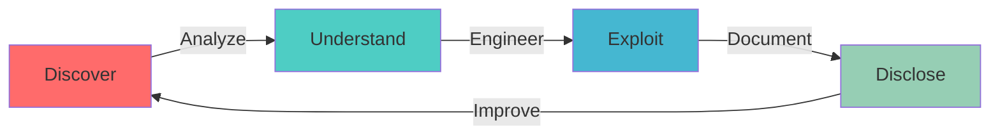

<div align="center">


<br/>

[](https://github.com/DGXploits)
[](https://github.com/DGXploits)
[](https://github.com/DGXploits)

<br/>

### 🎯 Security Research Organization

**Precision-driven vulnerability research** focusing on controlled exploitation, <br/>deep system understanding, and responsible disclosure.

<br/>

```
┌─────────────────────────────────────────────────────────────┐
│  "Access through understanding, not destruction."           │
│                                                             │
│  Every vulnerability is a technical phenomenon to be       │
│  analyzed, understood, and documented with precision.      │
└─────────────────────────────────────────────────────────────┘
```

<br/>

---

</div>

## 🔬 Core Philosophy

> **Understanding Over Destruction**

DGXploits approaches security research with surgical precision. We believe that true access comes from **deep technical understanding**, not brute force. Every vulnerability is treated as a complex technical phenomenon worthy of thorough analysis, not merely a target for exploitation.

<div align="center">



</div>

## 🎯 Research Focus Areas

<table>
<tr>
<td width="50%" valign="top">

### 🔍 **Vulnerability Research**
Deep analysis of security flaws across systems, applications, and infrastructure. Focused on discovering zero-day vulnerabilities and understanding attack surfaces.

### ⚔️ **Exploit Development**
Crafting precise, reliable exploits with full understanding of underlying mechanisms. Emphasis on weaponization techniques and payload engineering.

### 🔧 **Reverse Engineering**
Binary analysis, protocol dissection, and system internals exploration to uncover hidden functionality and security weaknesses.

</td>
<td width="50%" valign="top">

### 🎖️ **Bug Bounty Research**
Systematic vulnerability hunting in authorized programs. Focus on high-impact findings and complex exploitation chains.

### 📊 **Proof of Concept Engineering**
Creating reproducible, documented PoCs that demonstrate real-world impact while maintaining responsible disclosure standards.

### 🔐 **Security Analysis**
Comprehensive security assessments using offense-informed defense perspectives.

</td>
</tr>
</table>

## ⚡ Core Principles

<div align="center">

| Principle | Description |
|:---------:|:------------|
| **🎯 Precision over Aggression** | Every action is calculated, measured, and purposeful |
| **🧠 Understanding over Assumption** | Deep analysis before exploitation |
| **⚖️ Control over Chaos** | Methodical approach to security research |
| **🛡️ Ethics over Sensation** | Responsible disclosure and legal compliance |

</div>

## 🔨 Research Methodology

```ascii
┌─────────────────────────────────────────────────────────────────┐
│                    DGXPLOITS METHODOLOGY                        │
├─────────────────────────────────────────────────────────────────┤
│                                                                 │
│  1. RECONNAISSANCE      →  Information gathering & mapping      │
│  2. VULNERABILITY SCAN  →  Automated & manual discovery        │
│  3. DEEP ANALYSIS       →  Understanding the technical gap     │
│  4. EXPLOIT DEVELOPMENT →  Controlled weaponization            │
│  5. CHAIN ENGINEERING   →  Multi-stage attack scenarios       │
│  6. DOCUMENTATION       →  Reproducible technical writeups    │
│  7. RESPONSIBLE DISCLOSURE → Coordinated vulnerability disclosure │
│                                                                 │
└─────────────────────────────────────────────────────────────────┘
```

## 🎨 Visual Identity

<div align="center">

### Design Philosophy

| Element | Approach |
|:--------|:---------|
| **Aesthetic** | Minimal, abstract, precision-focused |
| **Symbolism** | Negative space representing vulnerability gaps |
| **Color Palette** | Dark themes with accent highlights |
| **Typography** | Monospace for technical authenticity |
| **Icons** | Geometric, non-stereotypical |

</div>

## 📋 Scope of Activities

- ✅ **Authorized Penetration Testing** - Systems with explicit permission
- ✅ **Bug Bounty Programs** - Official, sanctioned vulnerability research
- ✅ **Lab Environments** - Controlled testing and research setups
- ✅ **Security Tool Development** - Internal research tooling
- ✅ **Vulnerability Chaining** - Multi-stage exploitation research
- ✅ **Technical Documentation** - Reproducible security advisories

## 🚫 Ethical Boundaries

<div align="center">

| ❌ Never | ✅ Always |
|:---------|:----------|
| Unauthorized system access | Explicit written permission |
| Data theft or manipulation | Responsible disclosure |
| Malicious intent | Educational purpose |
| Illegal activities | Legal compliance |
| Sensationalism | Technical accuracy |

</div>

## 🛡️ Responsible Disclosure Policy

DGXploits adheres to strict ethical guidelines:

```
1. Only test systems with explicit authorization
2. Follow coordinated disclosure timelines
3. Protect user data and privacy
4. Provide actionable remediation guidance
5. Maintain transparency in research process
```

## 📚 Brand Usage

**DGXploits** identifier is used for:

- 🔬 Security research publications
- 🛠️ Internal tooling and frameworks
- 📖 Technical documentation and advisories
- 🎓 Educational content and writeups
- 🤝 Community engagement and collaboration

## 🌐 Research Areas

<div align="center">

```
╔════════════════════════════════════════════════════════════════╗
║                    TECHNICAL EXPERTISE                         ║
╠════════════════════════════════════════════════════════════════╣
║                                                                ║
║  • Web Application Security  • Binary Exploitation            ║
║  • API Security              • Memory Corruption              ║
║  • Cloud Infrastructure      • Privilege Escalation           ║
║  • Network Protocols         • Authentication Bypass          ║
║  • Cryptographic Flaws       • Race Conditions                ║
║  • Logic Vulnerabilities     • Deserialization Attacks        ║
║                                                                ║
╚════════════════════════════════════════════════════════════════╝
```

</div>

## 🤝 Collaboration & Contact

<div align="center">

### Get in Touch

For security research collaboration, responsible disclosure coordination,<br/>
or general inquiries, contact information will be provided through<br/>
appropriate channels based on context.

<br/>

[](https://github.com/DGXploits)
[](https://github.com/DGXploits)
[](https://github.com/DGXploits)

</div>

---

<div align="center">

### 🎯 Mission Statement

**Understand the system. Find the gap. Control the access.**

<br/>

*Precision in research. Excellence in execution. Ethics in practice.*

<br/>

```
━━━━━━━━━━━━━━━━━━━━━━━━━━━━━━━━━━━━━━━━━━━━━━━━━━━━
    DGXploits • Where Understanding Meets Exploitation
━━━━━━━━━━━━━━━━━━━━━━━━━━━━━━━━━━━━━━━━━━━━━━━━━━━━
```

<br/>

<sub>© 2026 DGXploits. All research conducted under strict ethical guidelines and legal compliance.</sub>

<br/>


</div>
